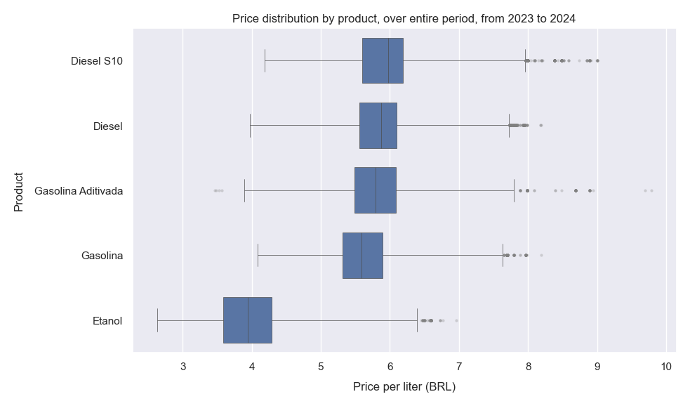
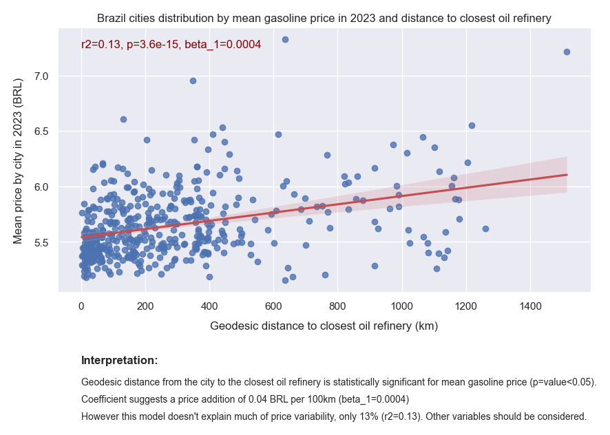
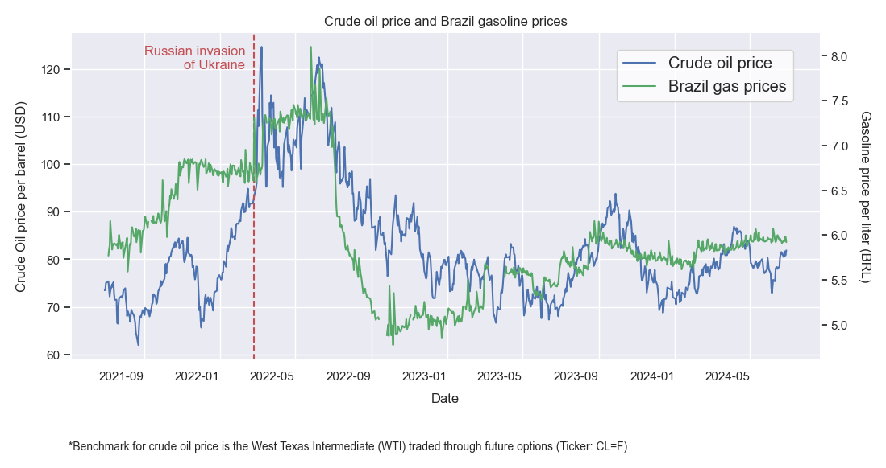

# Analysis of gas prices in Brazil - Pietro Bottega

## Objective

Understand different aspects regarding gasoline prices in Brazil. The guiding questions to be answered are the following:

- **Question 1:** How do prices of different fuel types compare?
- **Question 2:** Are there significant price differences between cities in Brazil? Can distance to refinery explain it?
- **Question 3:** How is the correlation between gas prices in Brazil and international crude oil price? 

## Data source: 

Open data from the "National Agency of Petroleum, Natural Gas and Biofuel" (translation of *Agência Nacional do Petróleo, Gás Natural e Biocombustíveis*), cleaned and treated by [Base dos Dados platform](https://basedosdados.org/). This agency tracks the price applied by fuel resellers through a weekly price survey, conducted by third party. [More details.](https://www.gov.br/anp/pt-br/assuntos/precos-e-defesa-da-concorrencia/precos/precos-revenda-e-de-distribuicao-combustiveis/informacoes-levantamento-de-precos-de-combustiveis)

- **Period:** 2023-01-01 to 2024-06-30 (except for external variable analysis)
- **Products:** Gasoline, Diesel, Ethanol; excludes natural gas.
- **Region:** Brazil, for most analysis. Some are limited to Rio Grande do Sul state (further identified as *RS*)

## Tools:

### Programming languages:
- SQL: used to query data from ANP data source, via "Base dos Dados" API
- Python: used for overall analysis in Jupyter Notebooks

### Libraries:
- Pandas: used for data manipulation of SQL query output, CSV file, and others.
- Geopy: used to calculate distance from cities to refinery, for Question 2
- yfinance: Yahoo Finance data, used to get Crude Oil future options
- Matplotlib, Seaborn: data visualization

## Results

### How do prices of different fuel compare?

Across most part of analyzed period, the median price of products is in descending order: Diesel, Gasoline, Ethanol.

'Added Gasoline' is the product with broader variation in the sample. As a curiosity it also represents the highest price observation, of almost 10 BRL per liter.

### Are there significant price differences between cities in Brazil?

The predictor variable (geodesic distance to closest oil refinery) is statistically significant, as indicated by the p-value below 0.05. However the model does not explain much of the variability in the response variable, as indicated by the R-squared value only 15% of its variance is explained. There are other important variables no included in the model. One of them could be state taxes, for example.

Note: It was used a geodesic method for calculating the shorter distance from the city centroid to a refinery in Brazil. It is the distance on a curvature, considering that the Earth is not a perfect sphere (default:  WGS-84 ellipsoid). For a future improvement, it would be interesting to use a method that can take on considerating the path of roads, which would be closer to the transportation of gas from refinery to the city.

### How is the correlation between gasoline prices in Brazil and international crude oil price?

The benchmark being used to represent crude oil international prices is West Texas Intermediate (WTI), one of the most commonly used benchmarks. It is traded as future options with the "CL=F" ticker.

Visually analysing the chart we see that Brazil gasoline prices follow a similar trend compared to Crude Oil price. However, an unexpected result is that Brazil gas price movements seem to antecipate Crude oil future options price movements.

A annotation was added on the chart to appoint a possible reason for the visible spike around February, 2022.

Until May, 2023, gasoline prices in Brazil were regulated to follow imports price, and keep in line with international prices. After that, gas prices started to be defined by other parameters. However, this policy change is not visible from the trend on chart.

